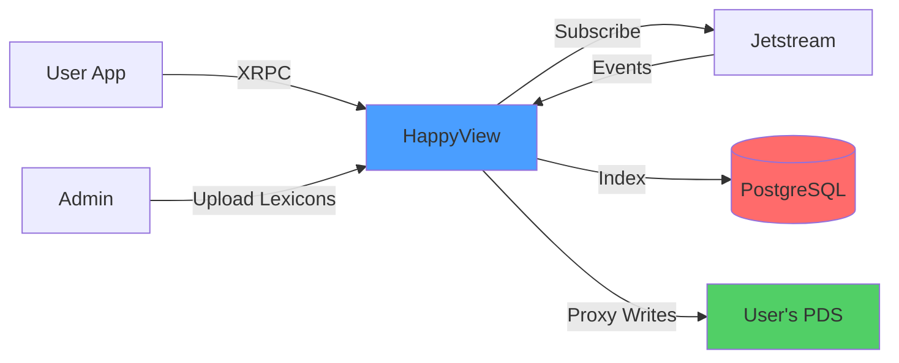
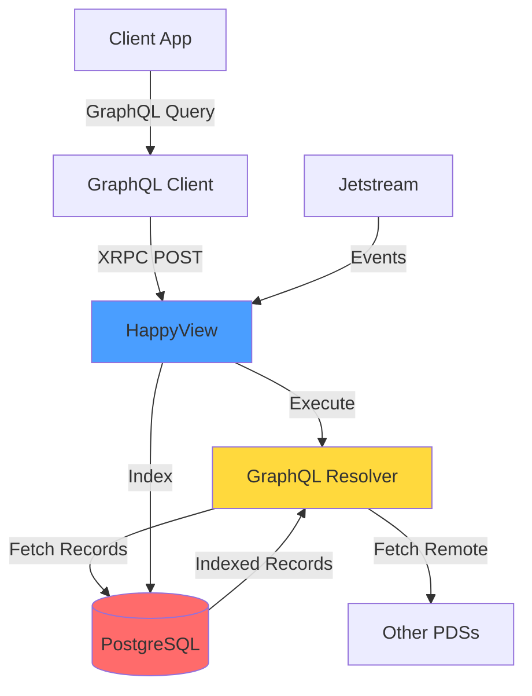
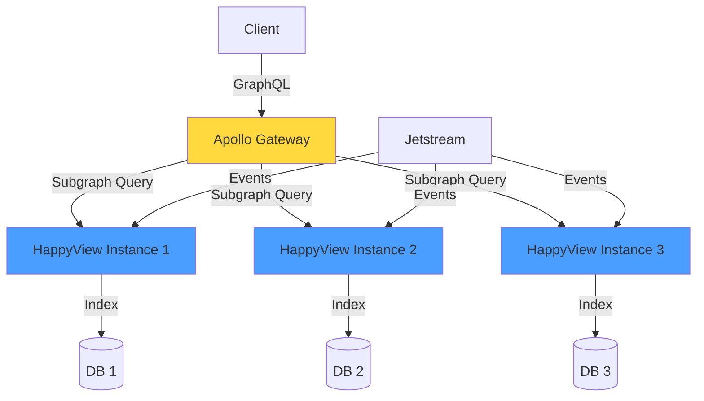
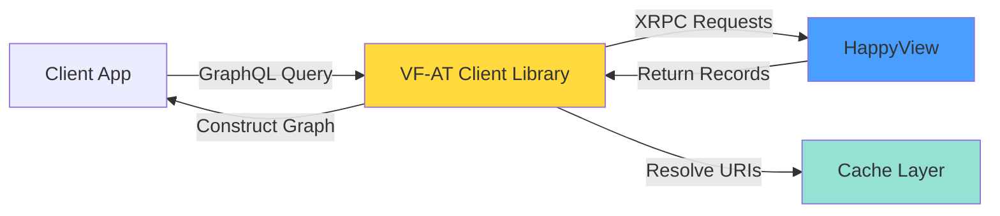

# ValueFlows + AT Protocol Integration: Deep Architectural Analysis

## Executive Summary

This document explores the integration of **ValueFlows GraphQL** (economic coordination vocabulary) with **AT Protocol** (decentralized social networking protocol) via **HappyView** (AT Protocol indexer/XRPC gateway). The integration represents a fascinating convergence of **economic coordination primitives** with **decentralized identity and data sovereignty**.

## Conceptual Alignment

### ValueFlows Core Concepts

ValueFlows provides a vocabulary for describing economic activities:

- **Agents**: People, Organizations (economic actors)
- **Economic Events**: Observed flows (produce, consume, transfer, work)
- **Economic Resources**: Tangible/intangible assets being coordinated
- **Commitments/Intents**: Future-oriented planning
- **Processes**: Transformations and workflows
- **Relationships**: Agent-to-agent connections

### AT Protocol Core Concepts

AT Protocol provides infrastructure for decentralized social applications:

- **DIDs**: Decentralized identifiers (portable identity)
- **Lexicons**: Schema definitions for record types
- **Records**: Typed data stored in Personal Data Servers (PDS)
- **XRPC**: Cross-repository procedure calls
- **Jetstream**: Real-time event stream
- **Repositories**: User-controlled data stores

### Natural Alignments

| ValueFlows Concept      | AT Protocol Mapping               | Rationale                                               |
| ----------------------- | --------------------------------- | ------------------------------------------------------- |
| **Agent** (Person/Org)  | **DID** + Profile Record          | Both represent autonomous actors with portable identity |
| **Economic Event**      | **Record** (custom lexicon)       | Both are immutable, timestamped facts                   |
| **Economic Resource**   | **Record** (custom lexicon)       | Both represent trackable entities with state            |
| **Agent Relationships** | **Follow/Block** + Custom Records | Both model social/economic connections                  |
| **Commitments/Intents** | **Records** (future-oriented)     | Both express future intentions                          |
| **Provenance/History**  | **Commit History** + CIDs         | Both provide cryptographic auditability                 |

## Architectural Tensions

### 1. **Schema Philosophy**

**ValueFlows (GraphQL)**:

- Strongly typed, interconnected graph
- Rich relationship traversal
- Server-side joins and aggregations
- Centralized schema evolution

**AT Protocol (Lexicons)**:

- Flat record types with URIs
- Client-side relationship resolution
- Decentralized schema registration
- Repository-scoped data

**Tension**: GraphQL assumes a unified graph; AT Protocol assumes distributed repositories.

### 2. **Data Sovereignty**

**ValueFlows**:

- Typically assumes shared collaboration spaces
- Collective visibility of economic flows
- Coordination requires mutual knowledge

**AT Protocol**:

- User-owned data in personal repositories
- Selective disclosure via permissions
- Federation, not centralization

**Tension**: Economic coordination often requires shared state; AT Protocol prioritizes individual control.

### 3. **Query Patterns**

**ValueFlows GraphQL**:

```graphql
query {
  economicEvent(id: "123") {
    action {
      label
    }
    provider {
      name
    }
    receiver {
      name
    }
    resourceInventoriedAs {
      name
      accountingQuantity {
        hasNumericalValue
        hasUnit {
          label
        }
      }
    }
  }
}
```

**AT Protocol XRPC**:

```
GET /xrpc/vf.economicEvent.get?uri=at://did:plc:abc/vf.economicEvent/123
```

Returns flat record; relationships require additional fetches.

**Tension**: GraphQL's power is in graph traversal; AT Protocol requires explicit URI dereferencing.

## Implementation Paths

### Path 1: **Lexicon-First (Minimal Bridge)**

**Approach**: Define AT Protocol lexicons for core VF types, store records in PDSs, use HappyView for indexing.

#### Architecture



#### Core Lexicons

1. **`vf.agent.person`** (record)

   ```json
   {
     "lexicon": 1,
     "id": "vf.agent.person",
     "defs": {
       "main": {
         "type": "record",
         "key": "tid",
         "record": {
           "type": "object",
           "required": ["name"],
           "properties": {
             "name": { "type": "string" },
             "image": { "type": "string", "format": "uri" },
             "note": { "type": "string" }
           }
         }
       }
     }
   }
   ```

2. **`vf.observation.economicEvent`** (record)

   ```json
   {
     "lexicon": 1,
     "id": "vf.observation.economicEvent",
     "defs": {
       "main": {
         "type": "record",
         "key": "tid",
         "record": {
           "type": "object",
           "required": ["action", "hasPointInTime"],
           "properties": {
             "action": { "type": "string" },
             "provider": { "type": "string", "format": "at-uri" },
             "receiver": { "type": "string", "format": "at-uri" },
             "resourceInventoriedAs": { "type": "string", "format": "at-uri" },
             "resourceQuantity": {
               "type": "object",
               "properties": {
                 "hasNumericalValue": { "type": "number" },
                 "hasUnit": { "type": "string" }
               }
             },
             "hasPointInTime": { "type": "string", "format": "datetime" },
             "note": { "type": "string" }
           }
         }
       }
     }
   }
   ```

3. **`vf.observation.economicResource`** (record)
4. **`vf.planning.intent`** (record)
5. **`vf.planning.commitment`** (record)

#### Query/Procedure Lexicons

1. **`vf.economicEvent.list`** (query)
   - Lists economic events with pagination
   - Filters by DID, action, date range

2. **`vf.economicEvent.create`** (procedure)
   - Creates new economic event
   - Proxies to user's PDS

#### Pros

- ✅ Leverages AT Protocol's identity and data sovereignty
- ✅ Real-time indexing via Jetstream
- ✅ User-owned economic data
- ✅ Simple to implement with HappyView

#### Cons

- ❌ Loses GraphQL's relationship traversal power
- ❌ Requires multiple round-trips for complex queries
- ❌ No server-side aggregations
- ❌ Limited to flat record structures

---

### Path 2: **GraphQL-over-XRPC Bridge**

**Approach**: Expose ValueFlows GraphQL schema via XRPC procedures, with HappyView acting as a GraphQL gateway.

#### Architecture



#### Implementation

1. **XRPC Procedure**: `vf.graphql.query`

   ```json
   {
     "lexicon": 1,
     "id": "vf.graphql.query",
     "defs": {
       "main": {
         "type": "procedure",
         "input": {
           "encoding": "application/json",
           "schema": {
             "type": "object",
             "required": ["query"],
             "properties": {
               "query": { "type": "string" },
               "variables": { "type": "object" }
             }
           }
         },
         "output": {
           "encoding": "application/json"
         }
       }
     }
   }
   ```

2. **HappyView Extension**: Add GraphQL execution engine

   ```rust
   // src/graphql/mod.rs
   use async_graphql::{Schema, EmptySubscription};
   use crate::lexicon::LexiconRegistry;

   pub struct VfQuery;
   pub struct VfMutation;

   pub type VfSchema = Schema<VfQuery, VfMutation, EmptySubscription>;

   pub async fn execute_graphql_query(
       schema: &VfSchema,
       query: String,
       variables: Option<serde_json::Value>,
   ) -> Result<serde_json::Value, AppError> {
       // Execute GraphQL query against indexed records
   }
   ```

3. **Resolver Implementation**
   ```rust
   #[Object]
   impl VfQuery {
       async fn economic_event(&self, ctx: &Context<'_>, id: ID) -> Result<EconomicEvent> {
           let pool = ctx.data::<PgPool>()?;
           let uri = format!("at://{}", id);

           let record = sqlx::query!(
               "SELECT record FROM records WHERE uri = $1",
               uri
           )
           .fetch_one(pool)
           .await?;

           Ok(serde_json::from_value(record.record)?)
       }

       async fn economic_events(
           &self,
           ctx: &Context<'_>,
           first: Option<i32>,
           after: Option<String>,
       ) -> Result<EconomicEventConnection> {
           // Implement pagination over indexed records
       }
   }
   ```

#### Pros

- ✅ Preserves GraphQL's expressive query power
- ✅ Single endpoint for complex queries
- ✅ Familiar developer experience
- ✅ Can leverage existing VF GraphQL tooling

#### Cons

- ❌ Requires significant HappyView extension
- ❌ GraphQL execution in Rust (or Node.js sidecar)
- ❌ Potential performance issues with complex queries
- ❌ Doesn't fully embrace AT Protocol's design

---

### Path 3: **Hybrid: Lexicons + GraphQL Federation**

**Approach**: Store records as AT Protocol lexicons, but provide a federated GraphQL gateway that can query across multiple HappyView instances.

#### Architecture



#### Implementation

1. **Each HappyView instance** exposes a GraphQL subgraph
2. **Apollo Gateway** federates queries across instances
3. **Lexicons** define the record types
4. **GraphQL resolvers** provide the query interface

#### Example Federation

```graphql
# HappyView Subgraph 1
type EconomicEvent @key(fields: "uri") {
  uri: ID!
  action: String!
  provider: Agent @provides(fields: "uri")
  resourceQuantity: Measure
}

extend type Agent @key(fields: "uri") {
  uri: ID! @external
  economicEvents: [EconomicEvent!]
}
```

#### Pros

- ✅ Best of both worlds: AT Protocol + GraphQL
- ✅ Scalable across multiple indexers
- ✅ Preserves data sovereignty
- ✅ Rich query capabilities

#### Cons

- ❌ Most complex to implement
- ❌ Requires Apollo Gateway or similar
- ❌ Federation adds latency
- ❌ Coordination between instances

---

### Path 4: **Client-Side GraphQL (Recommended)**

**Approach**: Store records as AT Protocol lexicons, provide a **client-side GraphQL library** that constructs queries from AT URIs.

#### Architecture



#### Implementation

**TypeScript Client Library**: `vf-at-client`

```typescript
import { AtpAgent } from "@atproto/api";
import { buildSchema } from "@valueflows/vf-graphql";

class VfAtClient {
  constructor(
    private agent: AtpAgent,
    private happyviewUrl: string,
  ) {}

  async query(gqlQuery: string, variables?: any) {
    // Parse GraphQL query
    const ast = parse(gqlQuery);

    // Convert to XRPC requests
    const requests = this.convertToXrpcRequests(ast);

    // Execute in parallel
    const results = await Promise.all(
      requests.map((req) => this.executeXrpc(req)),
    );

    // Reconstruct GraphQL response
    return this.reconstructGraphQLResponse(ast, results);
  }

  private async executeXrpc(request: XrpcRequest) {
    const response = await fetch(
      `${this.happyviewUrl}/xrpc/${request.method}?${request.params}`,
    );
    return response.json();
  }

  private convertToXrpcRequests(ast: DocumentNode): XrpcRequest[] {
    // Walk the GraphQL AST
    // For each field, determine the XRPC endpoint
    // Batch requests where possible
  }

  private reconstructGraphQLResponse(ast: DocumentNode, results: any[]) {
    // Merge XRPC responses into GraphQL shape
    // Resolve AT URIs to nested objects
  }
}
```

**Usage**:

```typescript
const client = new VfAtClient(agent, "https://happyview.example.com");

const result = await client.query(`
  query {
    economicEvent(uri: "at://did:plc:abc/vf.economicEvent/123") {
      action
      provider {
        name
        image
      }
      resourceInventoriedAs {
        name
        accountingQuantity {
          hasNumericalValue
          hasUnit
        }
      }
    }
  }
`);
```

**Client-side resolver**:

1. Fetches `at://did:plc:abc/vf.economicEvent/123`
2. Sees `provider: "at://did:plc:xyz/vf.agent.person/456"`
3. Fetches that URI
4. Reconstructs nested object

#### Pros

- ✅ **Preserves GraphQL developer experience**
- ✅ **Fully embraces AT Protocol's design**
- ✅ **No server-side GraphQL complexity**
- ✅ **Client controls data fetching strategy**
- ✅ **Can implement intelligent caching**
- ✅ **Works with any HappyView instance**

#### Cons

- ❌ Requires client library maintenance
- ❌ Multiple network requests (can be batched)
- ❌ No server-side aggregations
- ❌ Client must handle relationship resolution

---

## Recommended Implementation Path

**I recommend Path 4 (Client-Side GraphQL)** for the following reasons:

### 1. **Philosophical Alignment**

AT Protocol's design philosophy is **user agency** and **data sovereignty**. Forcing GraphQL's server-side graph model onto AT Protocol would undermine this. Instead, a client-side library **empowers applications** to construct the graph they need from distributed records.

### 2. **Practical Benefits**

- **Incremental adoption**: Start with simple lexicons, add GraphQL client later
- **Flexibility**: Different clients can have different query strategies
- **Caching**: Client-side caching is more effective than server-side
- **Offline-first**: Client can work with cached records

### 3. **Ecosystem Fit**

- HappyView remains a simple indexer (its core competency)
- GraphQL complexity lives in a library (can be iterated independently)
- AT Protocol's federation model is preserved

### 4. **Migration Path**

1. **Phase 1**: Define core VF lexicons
2. **Phase 2**: Implement basic XRPC queries in HappyView
3. **Phase 3**: Build `vf-at-client` library
4. **Phase 4**: Add advanced features (caching, batching, subscriptions)

---

## Detailed Implementation Plan

### Phase 1: Lexicon Design (2-3 weeks)

#### Tasks

- [ ] Map VF GraphQL types to AT Protocol lexicons
- [ ] Design URI structure for relationships
- [ ] Define core record types:
  - `vf.agent.person`
  - `vf.agent.organization`
  - `vf.observation.economicEvent`
  - `vf.observation.economicResource`
  - `vf.planning.intent`
  - `vf.planning.commitment`
- [ ] Define query lexicons:
  - `vf.economicEvent.list`
  - `vf.economicResource.list`
  - `vf.agent.list`
- [ ] Define procedure lexicons:
  - `vf.economicEvent.create`
  - `vf.economicResource.create`
- [ ] Write lexicon validation tests

#### Challenges

**Challenge 1: Representing Relationships**

VF uses bidirectional relationships (e.g., `economicEvent.provider` and `agent.economicEvents`). AT Protocol uses unidirectional URIs.

**Solution**: Use AT URIs for forward references, rely on indexer for reverse queries.

```json
{
  "$type": "vf.observation.economicEvent",
  "action": "produce",
  "provider": "at://did:plc:xyz/vf.agent.person/456",
  "resourceInventoriedAs": "at://did:plc:abc/vf.observation.economicResource/789"
}
```

Reverse query:

```
GET /xrpc/vf.economicEvent.list?provider=at://did:plc:xyz/vf.agent.person/456
```

**Challenge 2: Nested Objects vs. References**

VF has nested objects like `Measure`:

```graphql
type Measure {
  hasNumericalValue: Float!
  hasUnit: Unit!
}
```

**Solution**: Embed simple objects, reference complex ones.

```json
{
  "resourceQuantity": {
    "hasNumericalValue": 10.5,
    "hasUnit": "kg"
  }
}
```

For complex units, use references:

```json
{
  "resourceQuantity": {
    "hasNumericalValue": 10.5,
    "hasUnit": "at://did:plc:units/vf.measurement.unit/kilogram"
  }
}
```

### Phase 2: HappyView Integration (2-3 weeks)

#### Tasks

- [ ] Upload VF lexicons to HappyView
- [ ] Test record creation via XRPC
- [ ] Verify Jetstream indexing
- [ ] Implement query endpoints
- [ ] Add filtering and pagination
- [ ] Test backfill for existing records
- [ ] Document XRPC API

#### Example: Creating an Economic Event

```bash
curl -X POST https://happyview.example.com/xrpc/vf.economicEvent.create \
  -H "Authorization: Bearer $TOKEN" \
  -H "Content-Type: application/json" \
  -d '{
    "action": "produce",
    "provider": "at://did:plc:xyz/vf.agent.person/456",
    "resourceInventoriedAs": "at://did:plc:abc/vf.observation.economicResource/789",
    "resourceQuantity": {
      "hasNumericalValue": 10,
      "hasUnit": "kg"
    },
    "hasPointInTime": "2026-02-14T20:00:00Z",
    "note": "Harvested tomatoes"
  }'
```

### Phase 3: Client Library (4-6 weeks)

#### Tasks

- [ ] Set up TypeScript project: `vf-at-client`
- [ ] Implement GraphQL query parser
- [ ] Implement XRPC request converter
- [ ] Implement response reconstructor
- [ ] Add caching layer (in-memory, localStorage)
- [ ] Add batching for parallel requests
- [ ] Implement subscriptions (via Jetstream)
- [ ] Write comprehensive tests
- [ ] Write documentation and examples
- [ ] Publish to npm

#### Architecture

```typescript
// packages/vf-at-client/src/index.ts

export class VfAtClient {
  private cache: Cache;
  private batcher: RequestBatcher;

  constructor(
    private happyviewUrl: string,
    private agent: AtpAgent,
    options?: VfAtClientOptions,
  ) {
    this.cache = new Cache(options?.cache);
    this.batcher = new RequestBatcher(options?.batching);
  }

  async query<T>(query: string, variables?: any): Promise<T> {
    const ast = parse(query);
    const plan = this.createExecutionPlan(ast, variables);
    const results = await this.executePlan(plan);
    return this.reconstructResponse(ast, results);
  }

  async mutate<T>(mutation: string, variables?: any): Promise<T> {
    // Similar to query, but uses XRPC procedures
  }

  subscribe(query: string, callback: (data: any) => void): Subscription {
    // Connect to Jetstream, filter events, reconstruct GraphQL response
  }
}
```

#### Example Usage

```typescript
import { VfAtClient } from "vf-at-client";
import { AtpAgent } from "@atproto/api";

const agent = new AtpAgent({ service: "https://bsky.social" });
await agent.login({ identifier: "user.bsky.social", password: "xxx" });

const vfClient = new VfAtClient("https://happyview.example.com", agent, {
  cache: { ttl: 60000 }, // 1 minute cache
  batching: { maxBatchSize: 10, maxWaitMs: 50 },
});

// Query with automatic relationship resolution
const result = await vfClient.query(
  `
  query GetEvent($uri: ID!) {
    economicEvent(uri: $uri) {
      action
      hasPointInTime
      provider {
        name
        image
      }
      resourceInventoriedAs {
        name
        accountingQuantity {
          hasNumericalValue
          hasUnit
        }
      }
    }
  }
`,
  { uri: "at://did:plc:abc/vf.economicEvent/123" },
);

// Real-time subscription
const subscription = vfClient.subscribe(
  `
  subscription {
    economicEvents(action: "produce") {
      uri
      resourceQuantity {
        hasNumericalValue
      }
    }
  }
`,
  (event) => {
    console.log("New production event:", event);
  },
);
```

### Phase 4: Advanced Features (Ongoing)

- [ ] Optimistic updates
- [ ] Conflict resolution for offline edits
- [ ] GraphQL fragments and directives
- [ ] Query complexity analysis
- [ ] Rate limiting and backoff
- [ ] Multi-instance federation
- [ ] Analytics and telemetry

---

## Alternative Considerations

### Using AT Protocol's Native Features

Instead of GraphQL, could we use AT Protocol's native features more directly?

**App Views**: Custom indexers that aggregate records

- Could build a VF-specific app view
- Would be more "AT native"
- Loses GraphQL's standardization

**Lexicon Composition**: Reference other lexicons

```json
{
  "$type": "vf.observation.economicEvent",
  "provider": {
    "$type": "app.bsky.actor.defs#profileView",
    "did": "did:plc:xyz",
    "handle": "alice.bsky.social"
  }
}
```

### Leveraging Existing AT Protocol Patterns

**Follow Graph**: Use for agent relationships

```typescript
// Instead of custom AgentRelationship records
await agent.follow("did:plc:xyz");

// Query via app.bsky.graph.getFollows
const relationships = await agent.getFollows({ actor: "did:plc:abc" });
```

**Likes/Reposts**: Use for appreciation/endorsement

```typescript
// Economic event appreciation
await agent.like("at://did:plc:abc/vf.economicEvent/123");
```

This would make VF records **first-class citizens** in the AT Protocol ecosystem.

---

## Security and Privacy Considerations

### Data Visibility

**Challenge**: Economic data is often sensitive. AT Protocol's default is public records.

**Solutions**:

1. **Private PDSs**: Run private instances for sensitive data
2. **Encryption**: Encrypt record fields, share keys out-of-band
3. **Permissioned Indexers**: HappyView instances with access control
4. **Selective Disclosure**: Use DIDs with verifiable credentials

### Authentication

**Challenge**: Economic transactions require strong authentication.

**Solutions**:

1. **DID-based auth**: Leverage AT Protocol's DID system
2. **DPoP proofs**: HappyView already implements this
3. **Multi-sig**: For high-value transactions, require multiple signatures

### Auditability

**Benefit**: AT Protocol's content addressing (CIDs) provides cryptographic auditability.

```typescript
// Verify event hasn't been tampered with
const event = await client.query(`
  query {
    economicEvent(uri: "at://did:plc:abc/vf.economicEvent/123") {
      cid
      action
      resourceQuantity { hasNumericalValue }
    }
  }
`);

const verified = await verifyCid(event.cid, event);
```

---

## Performance Considerations

### Query Performance

**Challenge**: Client-side GraphQL requires multiple XRPC requests.

**Optimizations**:

1. **Request batching**: Combine multiple URI fetches
2. **Prefetching**: Fetch related records proactively
3. **Caching**: Aggressive client-side caching
4. **Denormalization**: Embed frequently accessed fields

### Indexing Performance

**Challenge**: HappyView must index all VF record types.

**Optimizations**:

1. **Selective indexing**: Only index fields used in queries
2. **Materialized views**: Pre-compute common aggregations
3. **Partitioning**: Partition by collection or date
4. **Read replicas**: Scale reads horizontally

---

## Migration and Adoption

### For Existing VF Implementations

**Path**: Dual-write to both existing backend and AT Protocol

```typescript
class VfDualWriter {
  async createEconomicEvent(event: EconomicEventInput) {
    // Write to existing backend
    const dbEvent = await this.db.createEvent(event);

    // Write to AT Protocol
    const atEvent = await this.vfClient.mutate(
      `
      mutation CreateEvent($event: EconomicEventCreateParams!) {
        createEconomicEvent(event: $event) {
          economicEvent { uri }
        }
      }
    `,
      { event },
    );

    // Link the two
    await this.db.updateEvent(dbEvent.id, { atUri: atEvent.uri });

    return dbEvent;
  }
}
```

### For New Applications

**Path**: AT Protocol-first, with optional backend for aggregations

```typescript
// Pure AT Protocol app
const app = new VfAtApp({
  happyview: "https://happyview.example.com",
  agent: myAgent,
});

// All data in user's PDS
await app.createEconomicEvent({
  action: "produce",
  resourceQuantity: { hasNumericalValue: 10, hasUnit: "kg" },
});

// Queries via HappyView indexer
const events = await app.listEconomicEvents({ limit: 20 });
```

---

## Open Questions

1. **How to handle VF's "collaboration spaces"?**
   - Could use AT Protocol's "lists" feature
   - Or custom `vf.collaboration.space` record type

2. **How to represent Units and Actions?**
   - Shared registry of units/actions?
   - Each instance defines their own?
   - Use URIs to reference external ontologies?

3. **How to handle complex queries like "all events in a process"?**
   - Server-side aggregation in HappyView?
   - Client-side filtering?
   - Materialized views?

4. **How to handle mutations that affect multiple records?**
   - AT Protocol doesn't have transactions
   - Use event sourcing pattern?
   - Accept eventual consistency?

5. **How to version lexicons?**
   - AT Protocol has lexicon versioning
   - But how to handle breaking changes?
   - Migration strategy?

---

## Conclusion

Integrating ValueFlows with AT Protocol via HappyView is **architecturally fascinating** and **practically valuable**. It brings economic coordination primitives to a decentralized, user-owned data ecosystem.

**The recommended path** is:

1. Define VF lexicons for AT Protocol
2. Implement XRPC endpoints in HappyView
3. Build a client-side GraphQL library (`vf-at-client`)
4. Iterate on advanced features

This approach **respects both systems' design philosophies** while providing a **pragmatic developer experience**. It enables:

- **User sovereignty**: Economic data lives in user-controlled PDSs
- **Decentralization**: No central coordination server required
- **Interoperability**: Standard AT Protocol + standard VF vocabulary
- **Developer experience**: Familiar GraphQL queries
- **Scalability**: Distributed indexing via multiple HappyView instances

The future of economic coordination may well be **decentralized, user-owned, and protocol-based**. This integration is a step in that direction.
