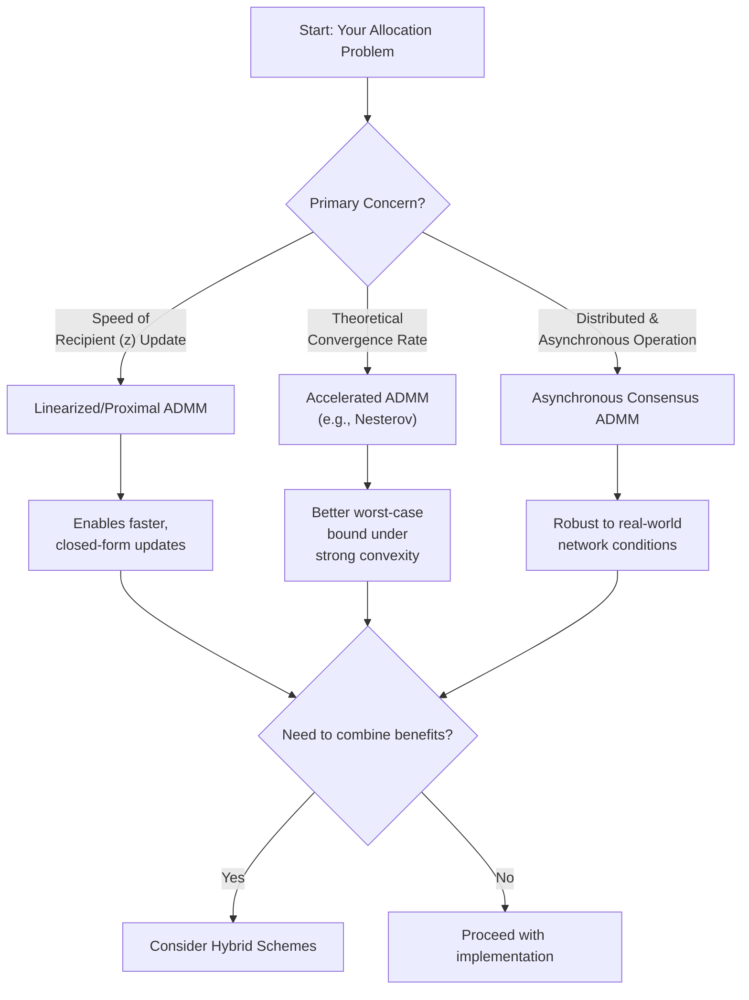

I can help you analyze the problem characteristics and provide a structured approach to selecting an ADMM variant for your distributed resource allocation framework. However, I must clarify that my analysis is based on the detailed system you've described (involving `x_sr`, `z_rs`, observer-relative truth, etc.) rather than new search results on accelerated methods, as the search hasn't found specific papers matching this novel framework.

Based on your description, here is a structured analysis and recommendation:

### **Analysis of Your Problem & Core Challenge**
Your framework presents a **classic two-block consensus problem** (`x_sr = z_rs`), making standard ADMM a natural fit. The primary challenge is the **recipient's non-linear, non-quadratic log-sum objective**, which complicates solving the `z`-update subproblem efficiently at scale.

### **Recommended Path: Hybrid or Linearized ADMM**
For your specific case, a single "accelerated" method may not suffice. I recommend considering a **hybrid or linearized approach**:

1.  **For the Provider (x-update)**: A standard, potentially accelerated ADMM step works well, as it's a simple quadratic program.
2.  **For the Recipient (z-update)**: This is the bottleneck. Here, **Linearized ADMM** or **Proximal ADMM** is highly recommended. These methods replace the complex exact minimization with a simpler gradient step plus a proximal term, which is crucial for your log-sum objective. The search results indicate these are state-of-the-art for handling complex non-quadratic terms.

### **Algorithm Selection Decision Framework**
Use this flow to guide your choice based on priorities:

To move forward, the most practical step is to **test these variants on a simplified model** of your problem. Implement a small-scale prototype (e.g., 3 providers, 5 recipients) to compare the convergence speed and per-iteration cost of:
*   **Standard ADMM** (as your baseline)
*   **Linearized ADMM** for the z-update
*   A full **Accelerated ADMM** (like the ones from the previous search results)

This experiment will give you concrete data to make the final choice.

Would you like a more detailed mathematical formulation for implementing a Linearized ADMM step specifically for your recipient's subproblem?


----
Design space:

Excellent question. Let me help you systematically outline the problem characteristics to select the right ADMM variant.

## **1. Problem Characteristics Analysis**

### **Structural Properties**

| Aspect | Your Problem | Implications for ADMM Choice |
|--------|-------------|------------------------------|
| **Variables** | Two sets: `x_sr` (provider→recipient), `z_rs` (recipient→provider) | Two-block ADMM natural fit |
| **Constraints** | Coupling constraint: `x_sr = z_rs` (consensus) | Standard consensus ADMM applicable |
| **Objective** | Separable: `f(x) + g(z)` | Perfect for ADMM decomposition |
| **Convexity** | Log-sum function is convex, constraints linear | Standard ADMM convergence guaranteed |
| **Scale** | Potentially thousands of providers/recipients | Need scalable, parallel implementation |

### **Computational Requirements**

1. **Privacy**: Each participant should solve local problem without sharing full utility function
2. **Asynchrony**: Cannot assume synchronized updates across all participants
3. **Fault tolerance**: Participants may drop out/rejoin
4. **Communication efficiency**: Minimize message passing
5. **Convergence speed**: Practical allocation times (~seconds to minutes)

## **2. ADMM Variant Decision Tree**

```
Start → Are variables naturally in two blocks? → Yes → Two-block ADMM
            ↓
        Do you need faster convergence? → Yes → Consider accelerated ADMM
            ↓
        Is network asynchronous? → Yes → Asynchronous ADMM
            ↓
        Do you have many participants? → Yes → Consensus ADMM
            ↓
        Need linear convergence? → Yes → Linearized ADMM
```

## **3. Recommended ADMM Variant: Consensus ADMM with Async Updates**

Based on your problem characteristics:

```python
# Problem Structure:
# Minimize ∑_s f_s(x_s) + ∑_r g_r(z_r)
# Subject to: A_s x_s = z_r (for connected pairs)

# Recommended variant: Distributed Consensus ADMM
```

**Why this fits:**

1. **Natural decomposition**: Providers and recipients solve independent local problems
2. **Privacy preserving**: Only allocation proposals are shared, not utility functions
3. **Scalable**: Each participant's problem size depends only on their connections
4. **Robust**: Can handle participants joining/leaving

## **4. Mathematical Formulation Options**

### **Option A: Standard Two-block ADMM** (Your current approach)

```
Primal: min f(x) + g(z) s.t. x = z
Augmented Lagrangian: L_ρ(x,z,u) = f(x) + g(z) + u^T(x-z) + (ρ/2)||x-z||²
```

**Pros**: Simple, well-understood, good convergence
**Cons**: Requires solving potentially large subproblems

### **Option B: Linearized ADMM**

For recipient subproblem where solving `min_z g(z) + (ρ/2)||z - a||²` is hard:

Replace with linear approximation:
```
z^{k+1} = argmin_z g(z^k) + ∇g(z^k)^T(z - z^k) + (ρ/2)||z - a||² + (L/2)||z - z^k||²
```

**Pros**: Closed-form updates, faster per iteration
**Cons**: More iterations needed, step size tuning

### **Option C: Multi-block ADMM** (If you want provider + recipient + type blocks)

```
min f(x) + g(z) + h(y)
s.t. A1x + A2z + A3y = b
```

**Pros**: More granular decomposition
**Cons**: Convergence not guaranteed for >2 blocks

## **5. Subproblem Solvers for Your Specific Case**

### **Provider Subproblem**
```python
# Provider s solves:
min_{x_s} ∑_r (ρ/2)(x_sr - z_rs + u_sr)^2
s.t. ∑_r x_sr ≤ q_s, x_sr ≥ 0

# This is a quadratic program with simplex constraint
# Can be solved via water-filling in O(m log m) where m = #recipients
```

### **Recipient Subproblem** (The harder one)
```python
# Recipient r solves:
min_{z_r} -N_r log(∑_s w_sr z_rs) + ∑_s (ρ/2)(x_sr - z_rs + u_sr)^2
s.t. ∑_s z_rs ≤ N_r, z_rs ≥ 0

# This is convex but non-quadratic
# Options:
# 1. Newton's method (exact but slow for many providers)
# 2. Proximal gradient (faster per iteration)
# 3. Frank-Wolfe/Conditional gradient (works well with simplex constraints)
```

## **6. Recommended Implementation Architecture**

Based on your requirements, I'd recommend:

### **Core Algorithm: Async Proximal ADMM**

```python
class AsyncProximalADMM:
    def __init__(self, rho=1.0, gamma=0.1):
        self.rho = rho  # penalty parameter
        self.gamma = gamma  # proximal term coefficient
        
    async def provider_update(self, provider_id):
        # Solve: min ∑_r (ρ/2)(x - z + u)^2 + (γ/2)||x - x_prev||^2
        # s.t. simplex constraint
        # Can use accelerated projected gradient
        
    async def recipient_update(self, recipient_id):
        # Solve: min -N log(∑ w z) + ∑ (ρ/2)(x - z + u)^2 + (γ/2)||z - z_prev||^2
        # s.t. simplex constraint
        # Use 2-3 steps of Frank-Wolfe
        
    async def dual_update(self, edge_id):
        # u = u + ρ(x - z)
        # Implement with atomic operations for async safety
```

### **Communication Layer**
```python
class GossipCommunication:
    def broadcast_update(self, participant_id, updates):
        # Send to connected participants only
        # Use eventual consistency model
        
    def get_latest(self, from_participant, max_staleness=5):
        # Accept updates with some staleness tolerance
        # Track version numbers
```

## **7. Tuning Considerations**

### **Penalty Parameter ρ**
```python
# Adaptive ρ scheme:
def update_rho(self, primal_residual, dual_residual):
    if primal_residual > 10 * dual_residual:
        self.rho *= 2
    elif dual_residual > 10 * primal_residual:
        self.rho /= 2
    # Keep between [rho_min, rho_max]
```

### **Stopping Criteria**
```python
def check_convergence(self):
    # Relative criteria:
    primal_gap = ||x - z|| / (1 + ||x|| + ||z||)
    dual_gap = ||u_new - u_old|| / (1 + ||u_old||)
    
    # Also check constraint satisfaction:
    capacity_violation = max(0, sum(x) - capacity)
    need_violation = max(0, sum(z) - need)
    
    return primal_gap < 1e-4 and dual_gap < 1e-4
```

## **8. Special Considerations for Your Framework**

### **Observer-Relative Truth**
ADMM needs consistent variable definitions across participants. With observer-relative attributes, you might need:

```python
def reconcile_views(self, entity_id, attribute):
    # Get all observer views
    views = get_observer_views(entity_id, attribute)
    
    # Apply consensus rule (most recent, highest confidence, etc.)
    reconciled_value = self.consensus_policy(views)
    
    return reconciled_value
```

### **Type Hierarchies**
For aggregation along memberOf edges:

```python
def aggregate_potentials(self, entity, type, direction='up'):
    if direction == 'up':
        # Sum potentials from categories
        total = sum(potentials_in_category(c, type) 
                   for c in entity.categories)
    else:
        # Sum potentials from participants
        total = sum(potentials_in_participant(p, type)
                   for p in entity.participants)
    return total
```

## **9. Alternative: Operator Splitting Methods Comparison**

| Method | Pros for Your Use Case | Cons |
|--------|------------------------|------|
| **ADMM** | ✓ Strong convergence<br>✓ Handles non-smooth terms<br>✓ Natural decomposition | Needs parameter tuning<br>Subproblems can be expensive |
| **Douglas-Rachford** | ✓ More robust to parameters<br>✓ Works with non-convexity | Slower convergence<br>Harder to implement |
| **Proximal Gradient** | ✓ Simple<br>✓ Fast iterations | Needs differentiable g<br>Slow for ill-conditioned |
| **Dual Averaging** | ✓ No tuning<br>✓ Works in purely online setting | Only for composite objectives |

## **10. My Specific Recommendation**

Given your problem characteristics:

**Use: Asynchronous Linearized Consensus ADMM with Adaptive ρ**

### **Implementation Outline:**
```python
class CommonsAllocator:
    def __init__(self):
        self.admm = AsyncLinearizedADMM(
            rho=1.0,
            adaptive_rho=True,
            max_iterations=1000,
            tolerance=1e-4
        )
        
        # Communication layer for observer-relative consistency
        self.communication = GossipLayer(
            max_staleness=3,
            conflict_resolution='latest_timestamp'
        )
        
        # Subproblem solvers
        self.provider_solver = SimplexProjectedGradient()
        self.recipient_solver = FrankWolfeSolver()
    
    async def allocate_round(self, timestamp):
        # 1. Reconcile observer-relative views
        reconciled_state = await self.reconcile_views()
        
        # 2. Run ADMM iterations asynchronously
        allocation = await self.admm.solve(
            providers=reconciled_state.providers,
            recipients=reconciled_state.recipients,
            constraints=reconciled_state.constraints
        )
        
        # 3. Record allocation
        self.records.add_allocation(timestamp, allocation)
        
        return allocation
```

### **Why This Combination:**
1. **Async**: Matches real-world distributed participation
2. **Linearized**: Makes recipient subproblem tractable
3. **Consensus**: Natural for x = z coupling
4. **Adaptive ρ**: Reduces tuning burden
5. **Proximal terms**: Stabilizes convergence

## **11. Validation Strategy**

Before full implementation:

1. **Test on small network** (3 providers, 5 recipients)
2. **Compare to centralized solution** (CVXPY) for correctness
3. **Benchmark convergence speed** vs network size
4. **Test robustness** to dropped messages/participants
5. **Verify anti-gaming properties** with strategic participants

## **12. Key Decision Points**

1. **Sync vs Async**: Async for real deployment, sync for testing
2. **Exact vs Approximate subproblems**: Start with exact (Newton), optimize later
3. **Global vs Local ρ**: Start with global, experiment with local per-edge ρ
4. **Warm-start**: Use previous allocation to accelerate convergence
