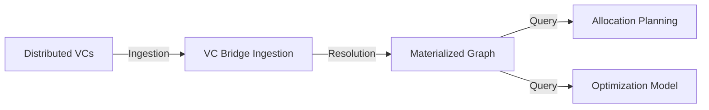

# Data Architecture Reflection
> "Architecture is about the stuff you can't change later."

## 1. The Core Data Pipeline

We must treat the generic graph as a **Materialized View** of the distributed ledger (VCs). The Planning System does not operate on raw VCs, but on this resolved view.

key flow:

## 2. The Conflict Problem

Since VCs are signed claims from different issuers, we will encounter:
1.  **Multiple claims about the same entity** (e.g. Alice claims "Skill: 10", Bob claims "Skill: 5").
2.  **Conflicting relationships** (e.g. Alice claims "memberOf: GroupA", GroupA claims "Alice not member").
3.  **Updates over time** (e.g. V1 says "Budget: 100", V2 says "Budget: 200").

### Current State vs Requirement
*   *Current*: `processVCsToNodes` creates a new Node object for every VC. If Alice has 2 VCs, she appears as 2 distinct objects in the array. `Graph` constructor maps by ID, so **last write wins** (silently overwriting).
*   *Requirement*: A **Merge Strategy**.

## 3. Resolution Strategies

We need a configurable resolution layer *before* the Graph is finalized.

### Strategy A: Trusted Issuer (Authoritative)
-   Only accept `memberOf` claims if signed by the *Parent*.
-   Only accept `capacity` claims if signed by the *Subject* (or a specific auditor).

### Strategy B: Accumulation (Union)
-   If multiple VCs describe `urn:user:Alice`, **merge** their attributes.
-   `skills`: Union of all claimed skills.
-   `budget`: Sum? Average? (Context dependent).

### Strategy C: Temporal (Latest Version)
-   Use `issuanceDate`.
-   Discard older claims for the same `credentialSubject.id` + `attribute`.

## 4. Filtering Stages

Filtering happens at three distinct boundaries:

1.  **Ingestion Filter (Security/Trust)**
    *   *Where*: `processVCsToNodes` loop.
    *   *Logic*: "Is signature valid?", "Is issuer banned?", "Is VC expired?".
    *   *Action*: Drop VC completely.

2.  **Resolution Filter (Coherence)**
    *   *Where*: The new `resolveConflicts(nodes)` step (Materialization).
    *   *Logic*: "Drop `memberOf` claim because Parent didn't countersign" or "Drop old version".
    *   *Action*: Prune attributes or entire nodes.

3.  **View/Query Filter (Context)**
    *   *Where*: `Graph.aggregateUp` / Traversal.
    *   *Logic*: "Calculate capacity but only consider `Active` members", "Only look at `Production` type VCs".
    *   *Action*: Skip nodes during traversal (runtime).

## 5. Next Steps for Implementation

1.  **Enhance Bridge**: Move from `Array<Node>` to `Map<ID, MergedNode>`.
2.  **Implement Merge Logic**: When `id` collision occurs, deep merge attributes using a strategy (default: Union for arrays, Latest for scalars?).
3.  **Implement Filtering**: Add `filter(predicate)` to the Fluent API `Graph` or `Traversal`.
