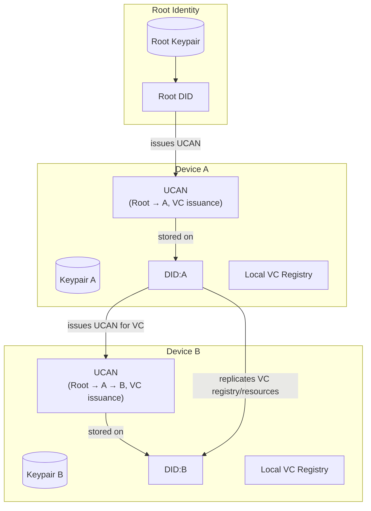
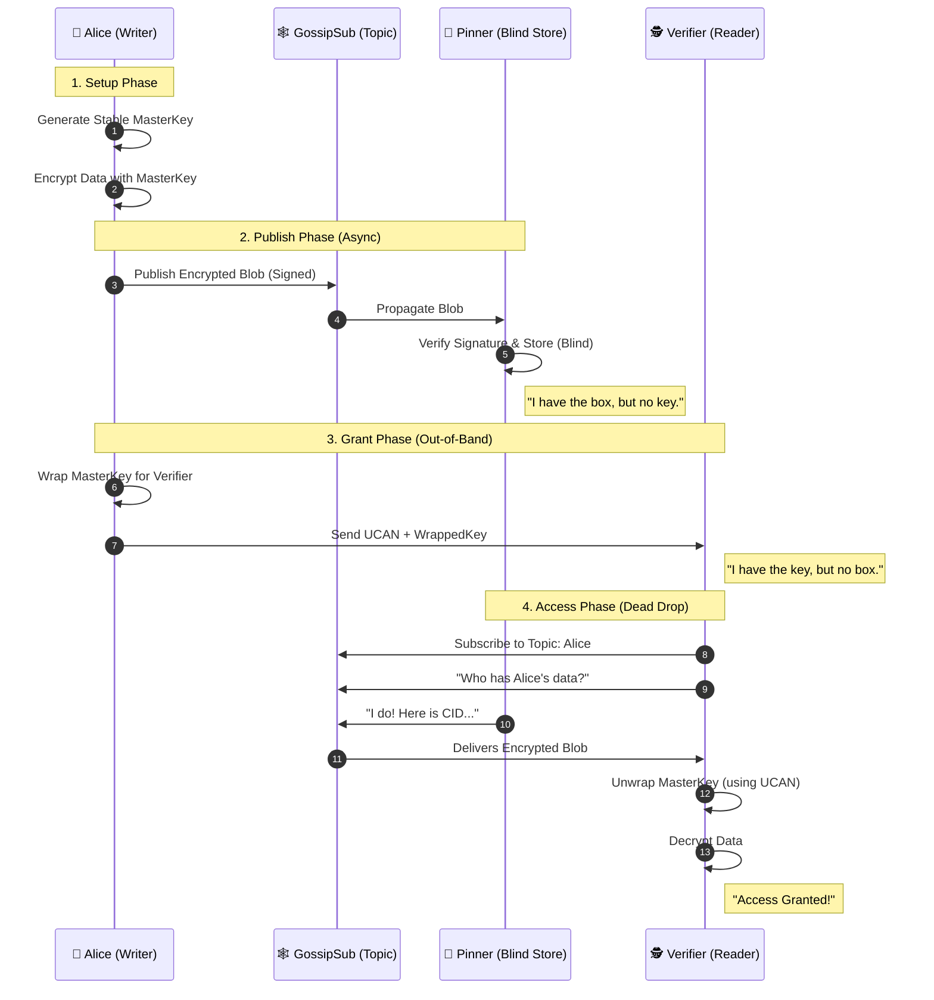

# Authentication Architecture: UCANs, DIDs, and Local-First Verifiable Credentials (VCs) with Fireproof

This document explains a **fully decentralized, Local-First identity and authorization system** using **DIDs, UCANs, and Verifiable Credentials (VCs)**. All critical responsibilities normally handled by a server are pushed to the client devices.

> **Implementation Note:** This architecture uses:
> - **[Fireproof](https://use-fireproof.com/)** for the storage and replication layer (encrypted CRDT database)
> - **[ucanto](https://github.com/web3-storage/ucanto)** for the UCAN protocol (RPC over UCAN)
> - **[@digitalbazaar/vc](https://github.com/digitalbazaar/vc)** for DID and Verifiable Credential implementation

> **Browser Constraints:** This system operates within browser-only constraints as detailed in `general-arc.md`. Fireproof handles WebRTC-based networking, IndexedDB storage, and content addressing (CAR files) natively.

---

## 1. The Core Atoms

### 🔑 Public / Private Keys (Device Keys)

* **What:** Each device generates a unique Ed25519 keypair.
* **Where:** Stored locally in IndexedDB / secure storage.
* **Purpose:** To prove control of a DID by signing messages, UCANs, and VCs.
* **Principle:** Keys are **never sent to a server**; all authority originates here.

---

### 🆔 DID (Decentralized Identifier)

* **What:** A self-certifying identifier derived from a public key (e.g., `did:key:z6MkhaXgB...`).
* **Properties:**

  * **Globally Unique**
  * **Self-Authenticating**
  * **Portable Across Apps**
* **Function:** Serves as the identity root, recognized across devices, apps, and peers.

---

### �️ Fireproof Database (Storage Layer)

* **What:** Content-addressed, encrypted, CRDT-based embedded database.
* **Where:** IndexedDB (browser), with CAR file exports for replication.
* **Purpose:** Store VCs, UCANs, and revocation lists with automatic replication across devices.
* **Built-in Features:**
  * **Encrypted by Default** - AES-256-GCM block-level encryption
  * **Content-Addressed** - CIDs (Content Identifiers) for integrity verification
  * **Conflict-Free Replication** - CRDTs handle concurrent updates automatically
  * **Merkle Proofs** - Cryptographic verification of query results
  * **Multi-Device Sync** - WebRTC, libp2p, or PartyKit connectors
* **Implementation:** Fireproof handles the entire storage, encryption, and replication infrastructure. Your code focuses on DID/UCAN/VC protocol logic on top.

---

### �👤 VC Assertions (Replacing Username)

* **What:** A **Verifiable Credential** issued about a **Subject** (which can be a User DID, a Group, a piece of Content, or another VC).
* **Purpose:** Provides a human-readable or policy-relevant assertion, e.g., membership, role, or reputation.
* **Local-First:** Devices maintain a **replicated registry of VCs** for peers or themselves, optionally syncing across trusted devices.

**Example mapping:**

```
VC Assertion → Root DID
```

* Each VC is **cryptographically signed**, making it verifiable.
* Delegation via UCAN allows devices to **issue VCs on behalf of the root DID**.

**Validation:**
* All VCs are validated using **Zod schemas** at issuance and verification
* Schema enforces W3C VC data model compliance
* Custom VC types (e.g., `MembershipCredential`) have specific Zod schemas
* TypeScript types are auto-generated from schemas

---

## 2. Identity & Authority Model

### Root Identity

* **Root DID** represents the user.
* Long-lived, globally referenceable.
* All authority originates from this root.
* Devices and apps are **delegates via UCANs**, authorized to issue or manage VCs.

---

### UCANs (Delegated Authority)

* UCANs are **cryptographic proof of permission**, now including **VC issuance rights**.
* Contain:

  * `iss` → issuing DID
  * `aud` → audience DID
  * `cap` → allowed actions (e.g., “issue VC type MembershipCredential”)
  * `prf` → optional previous UCAN (for chains)
  * **`exp` → Expiration Timestamp (REQUIRED)**. UCANs are **temporary by design**.
    *   *Device Delegation:* Typically long-lived (e.g., 3-12 months).
    *   *Session/Action:* Short-lived (e.g., 15 minutes).
* **Flow:** Root DID → Device → Device → VC issuance

**Validation:**
* All UCANs are validated using **Zod schemas** before acceptance
* Schema enforces required fields, expiration checks, and capability format
* TypeScript types are auto-generated from Zod schemas

---

## 3. Local-First VC Registration & Management

### Root DID Creation

1. Device generates **Root Keypair → Root DID**
2. Root DID is stored locally and optionally backed up via secure channels (QR code, encrypted cloud backup)

### Local VC Registry with Fireproof

Devices maintain a **replicated VC registry** using **Fireproof**, which provides:

```javascript
import { fireproof } from '@fireproof/core'
import { connect } from '@fireproof/connect'

// Create encrypted VC registry (IndexedDB + AES-256-GCM)
const vcRegistry = fireproof('vc-registry')

// Connect for multi-device sync via libp2p GossipSub
connect.libp2p(vcRegistry, 'my-identity-vcr')

// Store a VC - automatic encryption + content addressing
await vcRegistry.put({
  _id: 'vc-membership-123',
  issuer: myRootDID,
  credentialSubject: { membership: 'Dev Community' },
  proof: vcProof,
  issuedAt: Date.now()
})
```

**Fireproof handles automatically:**
* **Storage:** IndexedDB persistence
* **Encryption:** AES-256-GCM block-level encryption (keys in localStorage)
* **Content Addressing:** CAR files with CIDs for integrity verification
* **CRDT Replication:** Conflict-free merging across devices
* **Sync Protocol:** Delta sync via Merkle clocks (efficient updates)

**Conflict Resolution:**
* Fireproof's CRDTs handle concurrent updates automatically
* Last-write-wins for document fields
* Deterministic merge for conflicting changes
* No manual conflict resolution needed

**Discovery:**
* VCs are discoverable across trusted devices via replication
* Peers subscribe to updates via `vcRegistry.subscribe()`
* No central server required

---

### Device Authorization (Session UCAN)

* Root DID issues UCANs to each device it controls with **VC issuance capabilities**:

```
Root DID → Device A (can issue VC type MembershipCredential)
```

* Devices store UCAN locally and use them to **sign and issue VCs**.
* Other devices or apps can **verify the chain and trust the VC**, all locally.

---

## 4. Multi-Device Delegation

### Flow

1. Device B (new device) generates keypair → DID:B
2. Device A (existing device) issues **Delegation UCAN** to Device B:

```
Root DID → Device A → Device B (permission to issue specific VC types)
```

3. Device B can now **issue VCs** on behalf of the Root DID, fully verifiable by peers.
4. UCAN chains allow **offline verification** and local enforcement of permissions.

### Fireproof Multi-Device Sync

```javascript
// Device A (existing device)
const vcRegistry = fireproof('vc-registry')
connect.libp2p(vcRegistry, 'my-identity-vcr')

// Issue VC on Device A
await vcRegistry.put({
  _id: 'vc-new-member',
  issuer: myRootDID,
  credentialSubject: { role: 'contributor' },
  proof: signedByDeviceA
})

// Device B (new device) - same database name
const vcRegistry = fireproof('vc-registry')
connect.libp2p(vcRegistry, 'my-identity-vcr')

// Subscribe to changes - automatically receives VC from Device A
vcRegistry.subscribe((changes) => {
  console.log(`Synced ${changes.length} VCs from other devices`)
  // Fireproof's CRDT handles merging automatically
})
```

**Fireproof handles:**
* Automatic discovery of Device B when it connects
* Delta sync (only new VCs propagate, not entire database)
* Conflict-free merging if both devices issue VCs simultaneously
* Offline queue (changes sync when connection restored)

---

## 5. Local-First Responsibilities (Server Duties Moved to Device)

| Responsibility              | Implementation                                                                                                                  |
| --------------------------- | ------------------------------------------------------------------------------------------------------------------------------- |
| **VC Registry / Discovery** | ✅ **Fireproof database** with automatic CRDT replication and encryption                                                        |
| **UCAN Verification**       | ❌ **Your code** (using `ucanto` library) - Devices verify **delegation chains** locally                                        |
| **Resource Hosting**        | ✅ **Fireproof** stores in IndexedDB, replicates via **libp2p GossipSub** over WebRTC                                           |
| **Policy Enforcement**      | ❌ **Your code** - Devices enforce quotas and VC issuance rules locally                                                         |
| **Revocation**              | ✅ **Fireproof** stores deny-list (CRDT) + ❌ **Your code** checks revocation status before accepting VCs                       |
| **Data Validation**         | ❌ **Your code** - All protocol boundaries use **Zod schemas** for runtime validation                                           |
| **Encryption**              | ✅ **Fireproof** - AES-256-GCM block-level encryption managed automatically                                                     |
| **Sync Protocol**           | ✅ **Fireproof** - Merkle clocks and delta sync handle efficient updates                                                        |

> **Key Point:** Root DID and UCAN chains are the **single source of authority**; devices enforce VC issuance and verification locally. All data structures are validated with Zod at protocol boundaries.

---

## 6. Global Consistency & Interoperability

* Root DID anchors **all identity and authority**.
* Devices can **issue, replicate, and verify VCs offline**.
* Delegation chains ensure that **VCs issued by delegated devices remain trusted as if from root DID**.
* Optional replication allows **discovery of VC assertions across trusted peers**.

### Example

```json
{
  "issuer": "did:key:z6MkAliceRoot...",
  "credentialSubject": {
    "id": "did:key:z6MkAliceRoot...",
    "membership": "Local-First Dev Community"
  },
  "type": ["VerifiableCredential", "MembershipCredential"],
  "proof": "..."
}
```

* Signature verifies against the delegated device’s DID.
* UCAN chain proves device authority from the root DID.
* Entirely verifiable **without a server**.

---

## 7. Offline Capabilities & Constraints

A killer feature of VCs is **fully offline verification**.

### A. What Works Offline (No Internet)
*   **Signature Verification:** Pure math. If you have the Issuer's Public Key cached, you can verify a VC anywhere (airplane, remote area).
*   **Schema Validation:** Structure checks run locally.
*   **Expiration Checks:** Date comparisons are local.

### B. The Challenge: Revocation & Rotation
Offline verifiers **cannot** check the latest "Ban List" or see if a key was rotated *after* they went offline.

**Mitigations:**
1.  **Short-Lived Credentials:** If a VC expires in 24 hours, the risk window is capped.
2.  **Cached Revocation Lists:** Devices download the latest "Ban List" when online and use it while offline.
3.  **Risk Policy:** "If offline, accept low-value VCs (e.g., Gym Access) but block high-value ones (e.g., Bank Transfer)."

> **Summary:** VCRs provide **maximum verification in minimum connectivity**. Trust is bootstrapped Online (fetch keys), but verified Offline.

### C. Advanced Offline Architecture

To make offline VCs truly robust, we integrate:

1.  **Device Binding (Anti-Cloning):**
    *   *Problem:* Unlike a server session, you can't check if "Alice is already logged in elsewhere."
    *   *Solution:* The VC is bound to the **Device's Hardware Key**. The VC says *"This credential is valid ONLY if presented by the holder of Key X"*.

2.  **Fireproof Merkle Proofs (Data Integrity):**
    *   *Feature:* Fireproof provides cryptographic proofs for every query.
    *   *Benefit:* Verifiers can check **VC authenticity offline**.
    *   *Mechanism:* Each VC is stored in a content-addressed CAR file with a Merkle proof linking it to the database root. If data is tampered with, the CID changes and verification fails.

3.  **Selective Disclosure (Privacy) -- [Secondary Layer / Future Work]:**
    *   *Status:* **Deferred.** This is not a chief concern for the initial implementation.
    *   *Problem:* Showing your "Member Passport" offline might reveal too much.
    *   *Solution:* Future versions will implement **Zero-Knowledge Proofs (ZKPs)** or **BBS+ Signatures**.

---

## 8. Local-First Diagram with VC Issuance



---

## 8. Recovery & Loss Prevention

Since there is no central server to "reset" your account, recovery depends on **sharding trust** or **encrypted backups**.

### A. Level 1: Encrypted Cloud Backup (Self-Sovereign but Simple)
1.  **Encryption:** Device encrypts the **Root Private Key** with a strong passphrase (using Argon2/scrypt).
2.  **Storage:** The **encrypted blob** is stored on **IPFS and pinned** (by a pinning service or trusted peer) to guarantee availability.
    * **Note:** This is the **only use of IPFS** in this architecture. No live data flows through IPFS (see `general-arc.md`).
3.  **Recovery:** On a new device, you enter the passphrase to fetch and decrypt the key.

### B. Level 2: Social Recovery (Shamir's Secret Sharing)
For higher security without passwords:
1.  **Sharding:** The Root Key is mathematically split into `N` shards (e.g., 3).
2.  **Trust:** Shards are encrypted and sent to trusted friends' devices (Guardians).
3.  **Recovering:**
    *   You lose your device.
    *   You ask `K` friends (e.g., 2 of 3) to release their shards to your *new* device identity.
    *   Your new device reconstructs the Root Key.

### C. Key Rotation (The "Lost Root" Fix)
What if you lose the Root Key *and* have no backups, but you *do* have a logged-in laptop (Device B)?
*   **Problem:** You cannot recover the old Root Key. It is gone.
*   **Solution:** Device B (which has full authority) issues a **"Key Rotation"** statement.
    1.  Device B generates a **New Root Key** (Identity C).
    2.  Device B signs a message: *"I, acting as Alice (Root A), certify that Alice is moving to Root C."*
    3.  Peers update their address books: `Alice: DID:A -> DID:C`.
    4.  You then set up new backups/shards for **Root C**.

### D. Distributed Peer Recovery with Fireproof

You can recover your data from peers who were replicating it, using **Fireproof's distributed recovery**:

1.  **Restore Identity:** Recovery of Root Key (via method A or B above).
2.  **Connect & Announce:** New device connects to libp2p topics and announces identity (signed with Root Key).
3.  **Automatic Sync:** Fireproof's CRDT protocol requests missing data from peers.
4.  **Verification:** Merkle proofs ensure peers send authentic data.

```javascript
// 1. Recover Root Key & Identity
const myRootDID = deriveRootDID(recoveredRootKey)

// 2. Connect to network with empty database
const vcRegistry = fireproof('vc-registry')
connect.libp2p(vcRegistry, 'my-identity-vcr')

// 3. Fireproof automatically recovers data!
vcRegistry.subscribe((changes) => {
  console.log(`Recovered ${changes.length} VCs from peers!`)
})
```

> **Result:** As long as **one trusted peer** (or encrypted backup node) has your data, you can recover your entire VC registry just by authenticating with your Root Key.

### E. Data Persistence Strategy ("The iPad Purge")

Browsers (especially Safari/iOS) may wipe local data if storage is low or the site is unused for 7 days. **Sync is not Backup.**

To prevent data loss:
1.  **Always-On Peer:** Users are strongly encouraged to run one persistent node (Desktop App or Cloud Agent) that "pins" their data.
2.  **Manual Export:** The app provides a "Download Backup" feature to export the encrypted CAR file for cold storage.

---

## 9. Risks & Failure Modes ("Corner Cases")

To be fully transparent, this model introduces responsibilities that users are not used to.

### A. The "Total Loss" Scenario
If you lose:
1.  Your Root Key (Device A)
2.  **AND** All Backup Passwords
3.  **AND** All Trusted Friends (Social Recovery)
4.  **AND** All Delegated Devices (Device B, C...)

**Result: GAME OVER.** Your identity is mathematically irretrievable. You must create a new DID and rebuild your reputation from scratch. This is the price of total self-sovereignty.

### B. The "Stolen Device" Scenario (Revocation)
If a thief steals your Laptop (delegated via UCAN):
1.  **Action:** You (from your Phone) add a revocation entry to the **Fireproof Revocation Database**.
2.  **Propagation:** Fireproof automatically broadcasts this change to all peers via **libp2p**.
3.  **Effect:** Peers sync the new revocation list and stop accepting signatures from the stolen device.

```javascript
// Add revocation to Fireproof (automatically propagates)
await revocationList.put({
  _id: 'revoke-ucan-xyz',
  type: 'revocation',
  revokedUcanCid: 'bafy...',
  reason: 'device-stolen',
  issuedAt: Date.now()
})
```

4.  **Limitation:** This requires the network to *sync* the revocation. Until the message propagates, the thief has a window of opportunity (eventual consistency trade-off).
5.  **Mitigation:** Use short-lived UCANs for sensitive operations to minimize the revocation window.

---

## 10. One-Line Mental Model (VC-Focused)

> **Root DID = identity. UCANs = delegated authority. Devices = local issuers and verifiers of VCs. Servers = optional relays. VC assertions are first-class, verifiable, and delegated via UCANs.**

---

This version replaces the **username mapping** with **VC assertions**, integrates **VC issuance with UCAN delegation**, and ensures that **key rotation and multi-device delegation** still work seamlessly.

---

If you want, I can **also add a concrete JSON/JS example** showing:

1. Root DID delegates VC issuance to Device A via UCAN
2. Device A delegates to Device B
3. Device B issues a VC, verifiable as “Root DID authorized”

This would make it fully testable.

Do you want me to do that next?
---

## 11. Complete Code Example: Putting It All Together

Here is how **Fireproof (Storage/Sync)**, **ucanto (Delegation)**, and **VCs (Identity)** work together in production code:

```javascript
import { fireproof } from '@fireproof/core'
import { connect } from '@fireproof/connect'
import * as Client from '@ucanto/client'
import * as Signer from '@ucanto/principal/ed25519'
import { issue, verify } from '@digitalbazaar/vc'

// 1. Initialize Local-First Identity
const myKey = await Signer.generate()
const myDID = myKey.did()

// 2. Initialize Fireproof Databases
//    - vcRegistry: Stores Verifiable Credentials
//    - revocationList: Stores revoked UCANs
const vcRegistry = fireproof('vc-registry')
const revocationList = fireproof('revocation-list')

// 3. Connect to P2P Network (Automatic Sync)
connect.libp2p(vcRegistry, 'my-org-vcr')
connect.libp2p(revocationList, 'my-org-revocations')

// 4. Issue a VC (with UCAN Authorization Check)
async function issueVC(subjectDID, ucanDelegation) {
  
  // A. Verify UCAN Chain (Check rights)
  const result = await Client.verify(ucanDelegation, {
    capability: {
      with: myDID,
      can: 'vc/issue'
    },
    root: rootIssuerDID // The trusted root authority
  })

  // B. Check Revocation List (Fireproof Sync)
  for (const proof of ucanDelegation.proofs) {
    const isRevoked = await revocationList.get(proof.cid.toString())
    if (isRevoked) throw new Error('Delegation revoked!')
  }

  if (!result.ok) throw new Error('Unauthorized!')

  // C. Create & Sign VC
  const vc = {
    issuer: myDID,
    credentialSubject: { id: subjectDID, role: 'member' },
    issuanceDate: new Date().toISOString(),
    proof: await signVC(subjectDID, myKey) // Standard VC signing
  }

  // D. Store in Fireproof (Auto-Encrypt & Sync)
  await vcRegistry.put({
    _id: `vc-${Date.now()}`,
    ...vc
  })
  
  console.log('VC Issued & Synced to Peers!')
}

// 5. Verify Incoming VCs (from Peers)
vcRegistry.subscribe(async (changes) => {
  for (const change of changes) {
    const vc = await vcRegistry.get(change.id)
    console.log('New VC received via GossipSub:', vc)
  }
})
```

---

## 12. Signaling Infrastructure Specification

While the architecture is P2P, a minimal **Signaling Server (Discovery Relay)** is required to introduce peers (SDP exchange) before they can connect directly via WebRTC.

### Requirements
*   **Role:** Broker initial connections only. No data storage.
*   **Protocol:** WebSockets or HTTP.
*   **Implementation:**
    *   **Primary:** Fireproof's default PartyKit relay (zero-config).
    *   **Self-Hosted:** A lightweight PartyKit server or libp2p bootstrap node for total sovereignty.
*   **Usage:** Used *only* for peer discovery. Once connected, data flows directly device-to-device.

---

## 13. Schema Evolution & Versioning Strategy

Data stored in Fireproof is immutable and persistent. To prevent application crashes when schemas change over time (e.g., 2024 VC format vs. 2026 format), strictly follow this versioning strategy.

### Specification
1.  **Version Field:** All VCs **MUST** include a `schemaVersion` field (integer).
2.  **Parser Routing:** Application logic **MUST** check version before validation.

```typescript
// Router Pattern
function parseVC(data: unknown) {
    if (data.schemaVersion === 1) return V1Schema.parse(data);
    if (data.schemaVersion === 2) return V2Schema.parse(data);
    throw new Error(`Unknown schema version: ${data.schemaVersion}`);
}
```

---

## 14. Validation Timing: "Filter on Read" Pattern

Fireproof syncs data based on **transport authorization** (shared key), not **content validity**. A compromised peer could technically write validly encrypted but malformed data (garbage JSON) to the DB.

### Security Specification
1.  **Untrusted IO:** Treat **ALL** data retrieved from Fireproof as "Untrusted Input".
2.  **Filter, Don't Fail:** Never crash or stop sync on bad data. Filter it out silently at the query layer.
3.  **Trust-but-Verify Loop:**

```javascript
// ❌ BAD: Assuming validity
const vcs = await db.query('all')
vcs.forEach(renderVC) // Crashes if 1 VC is malformed

// ✅ GOOD: Filter on Read
const results = await db.query('all')
const validVCs = results.rows
    .map(row => row.doc)
    .filter(doc => {
        const result = VCSchema.safeParse(doc)
        if (!result.success) console.warn('Skipping malformed VC:', doc._id)
        return result.success
    })
    
renderVCs(validVCs) // Only renders strictly valid 
renderVCs(validVCs) // Only renders strictly valid 
```

---

## 15. The Grand Unified Architecture (GUA)

We replace central servers with a "Cypherpunk" stack: **Swarm Identity**, **Community Pinning**, and **Asynchronous Keys**.

### A. The "Swarm" Identity
Your identity is not a device. **You are a Swarm.**
*   **Controller:** `did:key:zRoot...` (Your Master Root Key).
*   **Topic:** `did:pkh:alice...` (Derived from Root Key).
*   **Membership:** Any device holding a valid Delegation UCAN from the Root Key is part of the Swarm.

### B. Community Pinning (Storage)
Data availability is provided by "Blind Replicas" (Always-On Peers).
1.  **Transport:** Data flows over **GossipSub** to any subscriber.
2.  **Pinning:** Friends, DAOs, or your own Cloud Agent pin your encrypted CAR blobs.
3.  **Privacy:** Pinners see only encrypted noise. They do not have the keys.

### C. Asynchronous Access ("Dead Drops")
How do you share data when you are offline?
1.  **Publish:** Your Swarm publishes encrypted data to the network (pinned by community).
2.  **Authorize:** You issue a UCAN to a Verifier (e.g., `did:verifier`).
3.  **Key Wrap:** You **encrypt the Stable Dataset Master Key** using the Verifier's Public Key and attach it to the UCAN.
4.  **Result:** The Verifier downloads the blob from the Swarm, unwraps the Master Key from the UCAN, and decrypts the stream. **One UCAN grants access to the whole dataset stream.**

### D. Visual Sequence: The "Dead Drop" Flow



---

## 16. Replication Strategies: Passive vs. Active

To foster a resilient yet efficient network, we distinguish between two modes of data synchronization:

### A. Passive Replication (The "Gossip" Layer)
*   **Definition:** Automatic "fire and forget" broadcast to the network without explicit coordination.
*   **Mechanism:** Global Publish-Subscribe (PubSub) using the **Gossip protocol**.
*   **Behavior:**
    *   Nodes "gossip" about state changes to random peers every second.
    *   Multi-hop: Updates propagate through the mesh like a viral message.
    *   Comparable to **UDP** (connectionless, broad reach).
*   **Use Case:**
    *   Broadcasting public headers (e.g., "I updated my KEL").
    *   Peer discovery.
    *   Collaborative environments where peers loosely follow updates (e.g., "Show me the latest posts").
*   **Implementation:** Enabled by default. Nodes publish updates to the larger topic; subscribers receive them eventually.

### B. Active Replication (The "Sync" Layer)
*   **Definition:** Direct, reliable, point-to-point synchronization with a specific node.
*   **Mechanism:** Dedicated connection (comparable to **TCP**) with acknowledgements.
*   **Behavior:**
    *   A specific node is chosen to **constantly receive updates**.
    *   Ensures 100% state transfer and data integrity between trusted pairs.
*   **Use Case:**
    *   **Archival:** Syncing to your "Always-On" Cloud Agent for backup.
    *   **Own Devices:** Keeping your Phone and Laptop strictly in sync.
    *   **Critical Data:** Situations where you cannot afford "eventual" consistency.

---

---

## 17. Identity Layering: De-conflicting Keys

In this GUA model, we strictly separate the "Envelope" from the "Letter".

| Layer | Key Type | Purpose | Responsibility |
| :--- | :--- | :--- | :--- |
| **1. Application** | `did:key` (Ed25519) | **Identity & Auth** | "I am Alice (Root), and I authorize this access." (Business Logic) |
| **2. Transport** | Fireproof/IPFS Key | **Sync & Write Access** | "I am a valid Swarm Node allowed to replicate." (Infrastructure) |

> **Rule:** The Root DID controls the Swarm. Fireproof Keys just drive the trucks.

